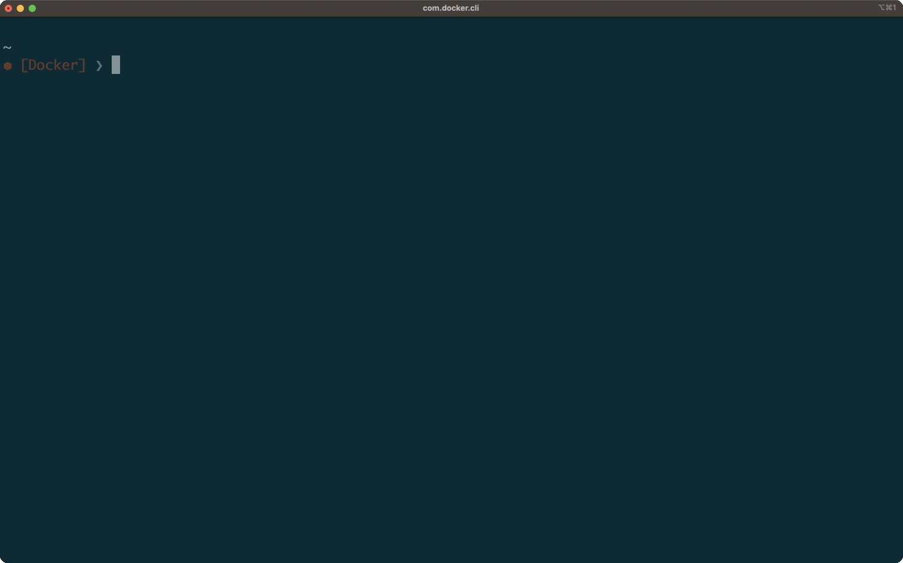

# Cargo Cleaner

[日本語](README.ja.md)

[](https://crates.io/crates/cargo-cleaner)

Cargo Cleaner is a TUI tool inspired by [cargo-clean-all](https://crates.io/crates/cargo-clean-all) for deleting target files in cargo projects.

It enables you to select cargo projects on the TUI screen and perform bulk deletion of the target directory (equivalent to cargo clean).



# Installation Method

## cargo install

```bash
cargo install cargo-cleaner
```

## Other Methods

Other methods are not yet prepared. Contributions are welcome!

# How to Use

## Simple Usage

```bash
cargo cleaner
```

Launching in this way, cargo cleaner will search for Cargo projects with target directories of positive size in all directories under the HOME directory.

## Key Bindings

| key      | description                    |
| -------- | ------------------------------ |
| `h`      | Display help                   |
| `j` or ↓ | Move down                      |
| `k` or ↑ | Move up                        |
| `g`      | Move to the top of the list    |
| `G`      | Move to the end of the list    |
| `SPACE`  | Select/deselect file at cursor |
| `v`      | Switch to auto-select mode     |
| `V`      | Switch to auto-deselect mode   |
| `ESC`    | Cancel mode                    |
| `d`      | Delete selected files          |
| `q`      | Quit                           |

## Dry Run

```bash
cargo cleaner --dry-run
```

Specifying dry-run allows you to check the behavior of cargo cleaner without actually deleting any files.

## Specify the Directory

```bash
cargo cleaner -r <directory>
```

By specifying the -r option, cargo cleaner will search for Cargo projects with target directories of positive size in all directories under the specified directory.
